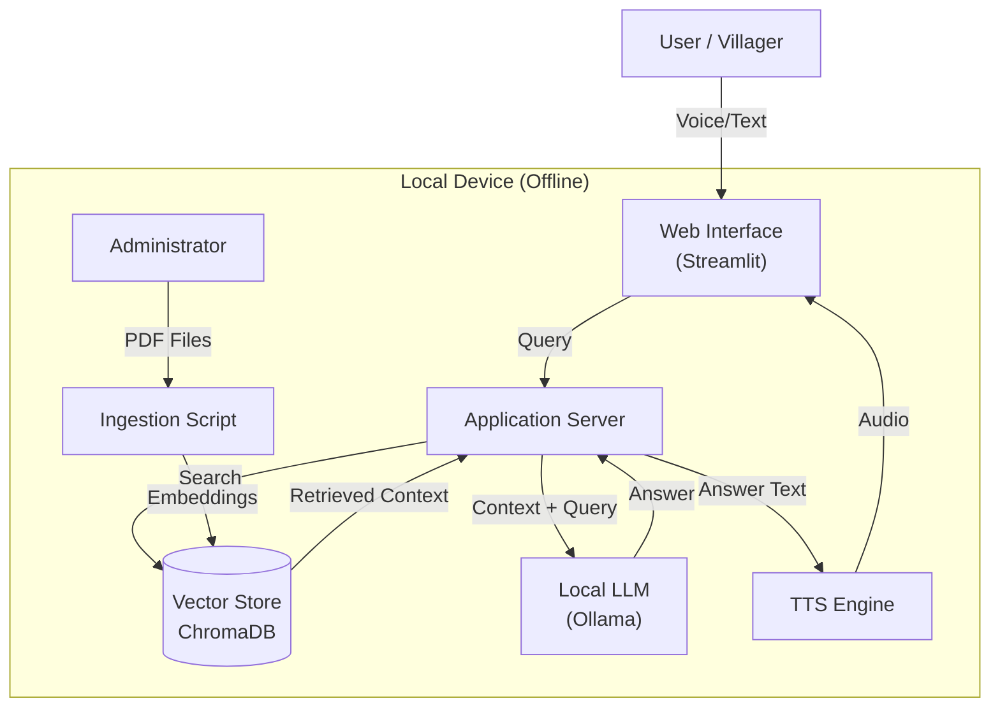

# Software Design - Civic Bridge
> Generated by Kiro Flow Simulation

## 1. System Architecture

The Civic Bridge system follows a modular **RAG (Retrieval-Augmented Generation)** architecture, strictly adhering to **Offline-First** principles.

### High-Level Diagram

## 2. Component Design

### 2.1. Ingestion Pipeline (`ingest_local.py`)
- **Purpose**: Process PDF documents and populate the knowledge base.
- **Flow**: `Load PDFs` -> `Split Text` -> `Generate Embeddings` -> `Upsert to VectorDB`.
- **Technologies**:
    - **Loader**: `PyPDFLoader` or `UnstructuredPDFLoader`.
    - **Splitter**: `RecursiveCharacterTextSplitter`.
    - **Embeddings**: `HuggingFaceEmbeddings` (e.g., `sentence-transformers/all-MiniLM-L6-v2`).
    - **Vector Store**: `Chroma` (persisted locally).

### 2.2. Core Application Server (`server.py` / `app.py`)
- **Purpose**: Orchestrate user interaction and RAG flow.
- **Logic**:
    1.  Receive user query.
    2.  Embed query using the same embedding model.
    3.  Perform similarity search in Vector Store (k=3 to 5 chunks).
    4.  Construct prompt: `Use the following context to answer the question: {context}. Question: {question}`.
    5.  Invoke Local LLM.
    6.  Return response.
- **Technologies**: `LangChain` (for orchestration), `Ollama` (for LLM serving).

### 2.3. User Interface
- **Purpose**: Simple interaction layer.
- **Features**:
    - Microphone button for voice input.
    - Chat window for text history.
    - Audio playback for answers.
- **Technologies**: `Streamlit`.

### 2.4. Voice Services
- **Speech-to-Text (STT)**:
    - **Model**: `faster-whisper` (small or base model) for offline transcription.
- **Text-to-Speech (TTS)**:
    - **Engine**: `pyttsx3` (offline system TTS) or `edge-tts` (requires connection, so strictly using offline alternatives like `coqui-tts` or system default if strictly offline). *Correction: `edge-tts` is online. We will use system TTS or a lightweight offline model.*

## 3. Data Model

### 3.1. Vector Store Schema
The vector store holds unstructured text chunks. Metadata explicitly tracked:
- `source`: Filename of the PDF.
- `page`: Page number of the content.

## 4. Technology Stack
| Component | Choice | Reason |
| :--- | :--- | :--- |
| **Language** | Python 3.9+ | Rich ecosystem for AI/ML. |
| **LLM Server** | Ollama | Easy management of local models (Llama 3, Mistral). |
| **Orchestration** | LangChain | Standard abstraction for RAG flows. |
| **Vector DB** | ChromaDB | Simple, file-based, easy to persist. |
| **UI Framework** | Streamlit | Rapid prototyping, built-in support for data apps. |
